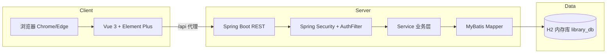
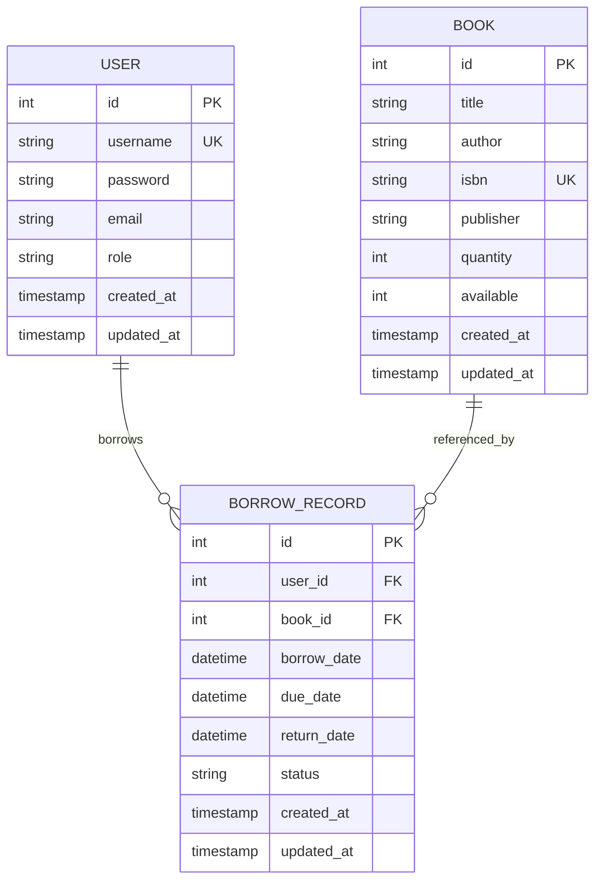
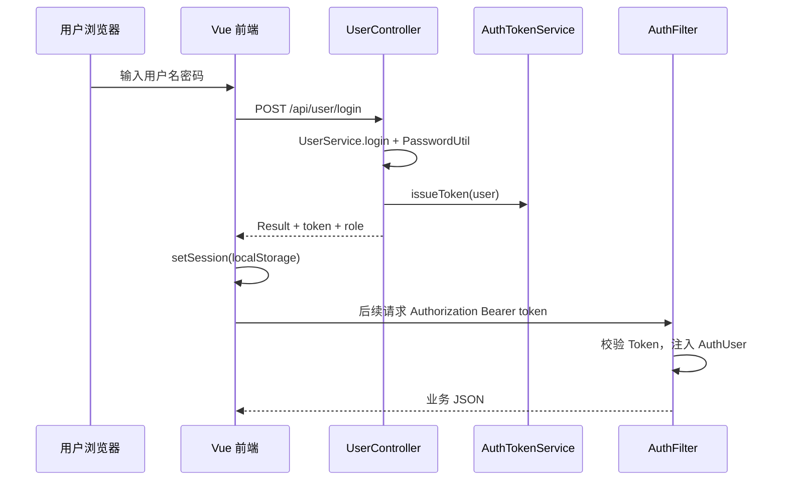

# 图书馆管理系统 - 系统设计

## 1. 文档信息

| 项目 | 内容 |
|------|------|
| 文档名称 | 系统设计 |
| 文档版本 | v1.0 |
| 创建日期 | 2026-05-18 |
| 项目名称 | 校园图书借阅管理系统 |

---

## 2. 系统概述

本系统采用 **B/S 架构、前后端分离**：浏览器访问 Vue 单页应用，通过 HTTP/JSON 调用 Spring Boot REST API；持久层使用 **MyBatis** 访问 **H2 内存数据库**（兼容 MySQL 语法模式，**当前未使用 MySQL 作为运行数据库**）。



---

## 3. 技术选型

### 3.1 技术栈总表

| 层次 | 技术 | 版本（项目实际） | 说明 |
|------|------|------------------|------|
| 前端框架 | Vue.js | 3.4.x | 组合式 API + `<script setup>` |
| 前端 UI | Element Plus | 2.5.x | 表格、表单、消息框 |
| 前端构建 | Vite | 5.x | 开发服务器、生产打包 |
| 前端路由 | Vue Router | 4.2.x | 路由守卫、懒加载 |
| HTTP 客户端 | Axios | 1.6.x | 统一拦截器附加 Token |
| 后端框架 | Spring Boot | 3.2.0 | Web、自动配置 |
| 安全 | Spring Security | 6.x | 过滤器链 + 自定义鉴权 |
| ORM | MyBatis Spring Boot | 3.0.3 | XML/注解 Mapper |
| 数据库 | **H2 Database** | 2.2.x | **内存模式**，启动初始化 |
| 语言 | Java | 17 | LTS |
| 构建 | Maven | 3.9+ | 后端打包与测试 |
| E2E（可选） | Playwright | 1.49+ | 性能与浏览器验收 |

> 说明：`pom.xml` 中声明了 `mysql-connector-java`，但 `application.properties` 仅配置 H2 数据源，**生产与演示均以 H2 为准**。

### 3.2 工程目录结构

```
library-system/
├── Backend/                          # Spring Boot 后端
│   ├── src/main/java/com/library/system/
│   │   ├── config/                   # SecurityConfig、AuthFilter
│   │   ├── controller/               # User、Book、Borrow、Migration
│   │   ├── service/                  # 业务逻辑
│   │   ├── mapper/                   # MyBatis 接口
│   │   ├── entity/                   # 实体类
│   │   └── common/                   # Result、PasswordUtil、AuthUser
│   ├── src/main/resources/
│   │   ├── application.properties    # H2 与 MyBatis 配置
│   │   ├── schema.sql                # 建表
│   │   └── data.sql                  # 初始数据
│   └── src/test/                     # 单元/集成/性能测试
├── frontend/                         # Vue 前端
│   ├── src/
│   │   ├── api/                      # book、user、borrow 封装
│   │   ├── views/                    # 页面组件
│   │   ├── router/                   # 路由与守卫
│   │   ├── config/menu.js            # 侧栏菜单
│   │   └── utils/                    # auth、request、message
│   └── e2e/                          # Playwright 用例
└── *.md                              # 需求、设计、测试等文档
```

---

## 4. 数据库设计

### 4.1 存储方案（H2 内存库）

| 配置项 | 值 |
|--------|-----|
| JDBC URL | `jdbc:h2:mem:library_db;MODE=MySQL;DB_CLOSE_DELAY=-1;DB_CLOSE_ON_EXIT=FALSE` |
| 用户名 | `sa` |
| 密码 | （空） |
| 初始化 | `spring.sql.init.mode=always`，加载 `schema.sql`、`data.sql` |
| 控制台 | `spring.h2.console.enabled=true`，路径 `/h2-console` |

**特点**：应用停止或重启后，内存数据清空并按脚本重新导入，适合演示与自动化测试，**不适合**作为长期生产持久化方案。

### 4.2 逻辑 ER 关系



### 4.3 表结构摘要

**user**

| 字段 | 类型 | 约束 | 说明 |
|------|------|------|------|
| id | INT | PK, AUTO_INCREMENT | 主键 |
| username | VARCHAR(50) | NOT NULL, UNIQUE | 登录名 |
| password | VARCHAR(255) | NOT NULL | BCrypt 或迁移前明文 |
| email | VARCHAR(100) | | 可选 |
| role | VARCHAR(20) | DEFAULT 'user' | `1` 管理员，`0` 读者 |
| created_at / updated_at | TIMESTAMP | | 审计字段 |

**book**

| 字段 | 类型 | 约束 | 说明 |
|------|------|------|------|
| id | INT | PK | 主键 |
| title | VARCHAR(100) | NOT NULL | 书名 |
| author | VARCHAR(50) | NOT NULL | 作者 |
| isbn | VARCHAR(20) | UNIQUE | 可选 |
| publisher | VARCHAR(100) | | 出版社 |
| quantity | INT | DEFAULT 1 | 馆藏总量 |
| available | INT | DEFAULT 1 | 当前可借册数 |

**borrow_record**

| 字段 | 类型 | 约束 | 说明 |
|------|------|------|------|
| id | INT | PK | 主键 |
| user_id | INT | FK → user.id | 借阅人 |
| book_id | INT | FK → book.id | 图书 |
| borrow_date | DATETIME | | 借出时间 |
| due_date | DATETIME | | 应还日期 |
| return_date | DATETIME | NULL | 实际归还时间 |
| status | VARCHAR(20) | | BORROWED / OVERDUE / RETURNED |

---

## 5. 系统架构设计

### 5.1 后端分层

| 层 | 职责 | 代表类 |
|----|------|--------|
| Controller | 接收请求、参数校验、封装 `Result` | `UserController`、`BookController`、`BorrowController` |
| Service | 业务规则、事务、逾期扫描 | `UserService`、`BookService`、`BorrowService` |
| Mapper | SQL 与实体映射 | `UserMapper`、`BookMapper`、`BorrowMapper` |
| Config / Common | 安全、工具、统一响应 | `SecurityConfig`、`AuthFilter`、`PasswordUtil` |

### 5.2 前端结构

| 模块 | 职责 |
|------|------|
| `router/index.js` | 登录拦截、`adminOnly` 路由保护 |
| `utils/request.js` | Axios 实例、Token 注入、401 处理 |
| `utils/auth.js` | localStorage 会话、`isAdmin()` |
| `views/*` | 各业务页面 |
| `config/menu.js` | 侧栏与标题按角色切换 |

### 5.3 部署与访问

| 组件 | 地址 | 说明 |
|------|------|------|
| 后端 API | http://localhost:8080 | `server.port=8080` |
| 前端开发 | http://localhost:5173 | Vite，`/api` 代理至后端 |
| H2 Console | http://localhost:8080/h2-console | JDBC URL 与 `application.properties` 一致 |

---

## 6. 安全与鉴权设计

### 6.1 认证流程



### 6.2 Spring Security 规则（`app.auth.enabled=true`）

| 路径 | 策略 |
|------|------|
| `OPTIONS /**` | 放行（CORS 预检） |
| `POST /api/user/login` | 匿名可访问 |
| `/h2-console/**` | 放行（开发） |
| `/api/**` | 需认证 |
| 其他 | 放行（静态资源等） |

未认证访问 `/api/**` 时返回 HTTP 200 + `Result.unauthorized`（与前端约定一致）。

### 6.3 密码策略

- 新密码经 `PasswordUtil` 使用 **BCrypt** 编码存储。
- 登录时 `matchesLogin` 兼容历史明文，匹配成功后可在迁移流程中升级为哈希。
- 编辑用户时密码字段为空则**不更新**密码字段。

---

## 7. 核心业务设计

### 7.1 借书流程

1. 校验用户、图书存在。
2. 调用 `bookMapper.decreaseAvailable(bookId)`（条件 `available > 0`），失败则抛出「图书不可借」。
3. 在 `@Transactional` 内插入 `borrow_record`，`status = BORROWED`，写入 `borrow_date`、`due_date`（由前端或接口传入）。

### 7.2 还书流程

1. 根据记录 ID 查询借阅记录。
2. 若已 `RETURNED` 则幂等返回。
3. 图书 `available + 1` 并更新图书记录。
4. 设置 `return_date`、`status = RETURNED`。

### 7.3 逾期处理

- `BorrowService.refreshOverdueStatus()`：扫描未归还记录，应还日 `< 今天` 则更新为 `OVERDUE`。
- 在列表查询、逾期提醒接口调用前触发，保证展示与库内状态一致。
- `GET /api/borrow/overdue/reminder` 返回逾期条数及明细（含 `overdueDays`）。

### 7.4 删除与 ID 重排

删除用户、图书或借阅记录后，通过 Mapper 将剩余记录 ID 重排为连续整数并重置自增序列，满足课程/计划中对「删除后 ID 连续」的验收要求。

### 7.5 图书 quantity 与 available

编辑图书总量时，`BookService` 按规则同步可借册数，避免总量小于已借出册数导致数据不一致。

---

## 8. 接口设计（REST）

统一响应：

```json
{
  "code": 200,
  "message": "操作成功",
  "data": { }
}
```

常见 `code`：`200` 成功，`401` 未登录或登录失败，`500` 业务/系统错误。

### 8.1 用户模块 `/api/user`

| 方法 | 路径 | 说明 |
|------|------|------|
| POST | `/login` | 登录，返回 token、id、username、role |
| POST | `/logout` | 注销 Token |
| GET | `/me` | 当前用户 |
| GET | `/list` | 用户列表 |
| GET | `/search?keyword=` | 搜索用户 |
| GET | `/find/{id}` | 按 ID 查询 |
| POST | `/add` | 新增 |
| PUT | `/update` | 更新 |
| DELETE | `/delete/{id}` | 删除 |

### 8.2 图书模块 `/api/book`

| 方法 | 路径 | 说明 |
|------|------|------|
| GET | `/list` | 全部图书 |
| GET | `/search?keyword=` | 多字段模糊搜索 |
| GET | `/available` | 可借图书 |
| GET | `/find/{id}` | 详情 |
| POST | `/add` | 新增 |
| PUT | `/update` | 更新 |
| DELETE | `/delete/{id}` | 删除 |
| GET | `/duplicates` | 重复书列表 |
| DELETE | `/duplicates` | 清理重复 |

### 8.3 借阅模块 `/api/borrow`

| 方法 | 路径 | 说明 |
|------|------|------|
| GET | `/list?keyword=` | 列表（管理员全馆，读者本人；支持 keyword） |
| GET | `/user/{userId}` | 指定用户借阅 |
| POST | `/borrow` | 借书 body: userId, bookId, dueDate |
| POST | `/return` | 还书 body: id（记录 ID） |
| GET | `/overdue/reminder` | 逾期提醒 |
| DELETE | `/delete/{id}` | 删除记录 |

### 8.4 迁移模块 `/api/migration`（维护用）

| 方法 | 路径 | 说明 |
|------|------|------|
| POST | `/add-due-date` | 历史库补应还日字段 |
| POST | `/update-password-length` | 扩展密码列长度 |
| POST | `/remove-duplicate-admins` | 去除重复管理员 |
| POST | `/remove-duplicate-users` | 去除重复用户 |
| POST | `/resequence-user-ids` | 用户 ID 重排 |

---

## 9. 前端设计要点

### 9.1 路由

| 路径 | 组件 | 权限 |
|------|------|------|
| `/login` | Login | 公开 |
| `/` | Home（布局 + 欢迎页） | 需登录 |
| `/users` | UserManage | 仅管理员 |
| `/books` | BookManage | 登录用户（读者只读检索） |
| `/borrows` | BorrowManage | 登录用户 |
| `/profile` | Profile | 登录用户 |

### 9.2 交互规范

- 成功/失败提示：`ElMessage`；删除等危险操作：`ElMessageBox.confirm`。
- 退出：调用 `POST /api/user/logout` 后 `clearSession()` 并跳转登录页。
- 全局样式：`src/styles/animations.css` 提供路由与组件过渡。

---

## 10. 非功能实现

| 需求 | 实现方式 |
|------|----------|
| 查询 ≤1s | 列表 SQL + 索引字段；`ApiPerformanceTest` 断言 |
| 页面 ≤2s | Vite 分包（vue、element-plus）；Playwright 测量导航 |
| Gzip | `server.compression.enabled=true` |
| 测试隔离 | `@Profile("!test")` 生产安全配置；测试使用 `TestSecurityConfig` |

---

## 11. 与 MySQL 的关系说明

| 项目 | 说明 |
|------|------|
| 当前运行 | **仅 H2 内存库**，配置见 `application.properties` |
| SQL 脚本 | 使用 MySQL 兼容语法（反引号、`AUTO_INCREMENT` 等），由 H2 `MODE=MySQL` 解析 |
| MySQL 驱动 | 存在于 `pom.xml`，便于将来切换；**切换需另行修改数据源配置，不属于当前交付范围** |
| 持久化 | 若将来改用 MySQL，需将 `spring.datasource.*` 改为 MySQL 连接，并评估 `spring.sql.init` 是否仅首次执行 |

---

## 12. 修订记录

| 版本 | 日期 | 修订说明 |
|------|------|----------|
| v1.0 | 2026-05-18 | 初稿，与 H2 内存库及现有代码结构对齐 |
